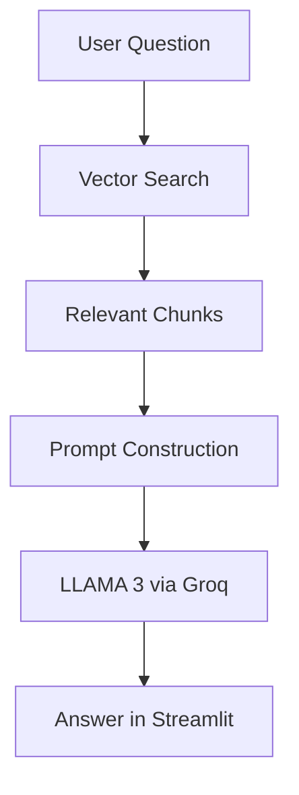

# 📘 Educosys RAG Notes Chatbot

A local, privacy-first AI assistant that uses LLaMA 3 and LangChain to answer questions from handwritten and typed notes via semantic search.

---

## ✨ Features

- 🔍 Ask natural language questions from your personal notes
- 📂 Supports PDF, DOCX, and TXT formats (typed and handwritten)
- 🧠 Powered by FAISS + MiniLM for fast semantic retrieval
- 🤖 Uses LLaMA 3 via Groq API for contextual answers
- ⚡ Built with Streamlit for a lightweight, interactive UI
- 🔒 Runs entirely on your machine (except LLM inference)

---

## 🧠 System Overview

